# COM-LAB-I-2567-LabSheet-Week-14

## การใช้งาน visual studio code ทำงานร่วมกับ github
### สร้างโปรเจค web site ด้วย Blazor server
1. ติดตั้ง visual studio code (ถ้ายังไม่ได้ติดตั้ง)

2. ติดตั้ง extension ต่อไปนี้ลงใน vs code

    2.1  C#  Base language support for C#

    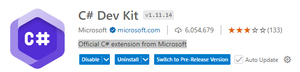

    2.2 C# Dev Kit Official C# extension from Microsoft
    

    2.3 Git Graph  View a Git Graph of your repository, and perform Git actions
    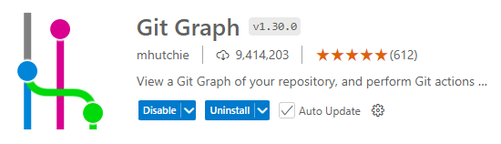

    2.5 Open in GitHub  Open the current project or file in github.com.
    

    2.6 อื่น ๆ ที่เกี่ยวข้องกับการทดลอง ติดตั้งเมื่อต้องการ


    __หมายเหตุ__ เครื่องที่ใช้สาธิต ได้ติดตั้ง extension ต่าง ๆ ไว้แล้ว จึงสามารถทำงานได้อย่างต่อเนื่อง หากเครื่องของนักศึกษายังไม่ได้ติดตั้ง extension อาจจะเกิดข้อผิดพลาด ให้แก้ไขตามอาการที่โปรแกรม vscode แจ้งเตือน

3. สร้าง folder ใหม่ในที่อยู่และชื่อที่จดจำง่าย เช่น `d:\Dotnet_Labs\`

4. ใน vs code ให้เปิด folder ที่สร้างในข้อ 3
    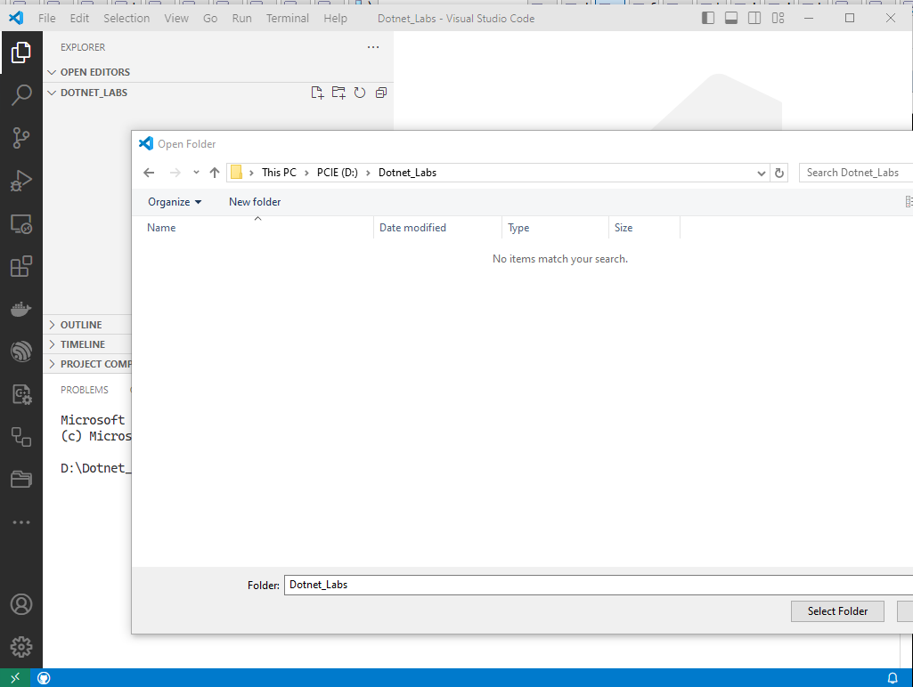

5. ใน vs code ให้เปิด terminal 

    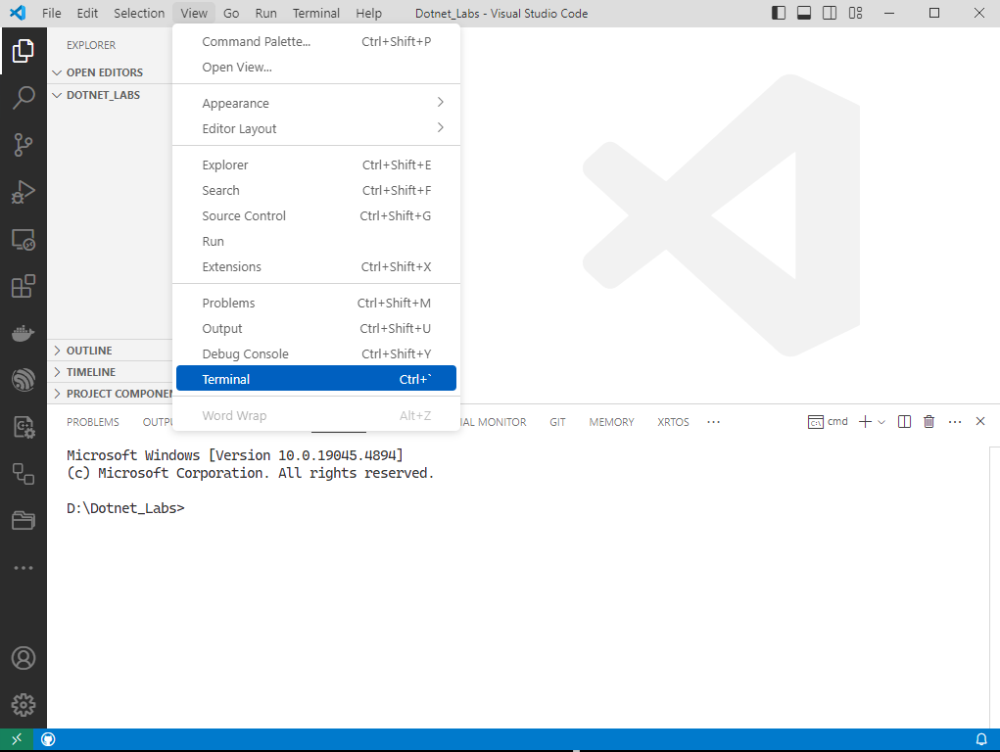

6. ใน command terminal ให้พิมพ์

```cmd
    dotnet new blazorserver -n blazorserver1 -o blazorserver1
```
เมื่อ
    `dotnet`  เป็นคำสั่งของ .NET
    `new`  ใช้สำหรับสร้าง project หรือไฟล์ชนิดต่างๆ ดูได้จากที่นี่ -> [อ้างอิง : คำสัง dotnet-new]( 
    https://learn.microsoft.com/en-us/dotnet/core/tools/dotnet-new)
    `-n <project name>` เป็นชื่อของ project ที่จะสร้าง
    `-o <directory>` เป็นชื่อของ folder ที่จะเก็บ project ถ้าไม่ระบุ จะใช้ directory ซึ่งต้องระวัง เพราะถ้าสร้างหลายรอบ ไฟล์ต่าง ๆ จะถูกสร้างที่เดียวกัน อาจจะทับหรือปะปนกันจนไม่สามารถใช้งาน project ได้

   7. ใน command terminal ให้พิมพ์

```cmd
    cd  blazorserver1 
``` 
เพื่อเข้าไปทำงานในโปรเจค `blazorserver1` ที่สร้างขึ้นในข้อ 6

   8. ใน command terminal ให้พิมพ์

```cmd
    dotnet build 
``` 
การ build ในครั้งแรก ควรจะไม่มี error ใดๆ ดังรูป

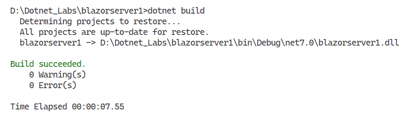

   9. ใน command terminal ให้พิมพ์

```cmd
    dotnet run 
``` 

dotnet อาจจะ build โปรเจคอีกครั้งและรัน เว็บเซอร์ฟเวอร์ขึ้นมา 

ซึ่งควรจะมีเอาต์พุตตามตัวอย่างในรูปนี้

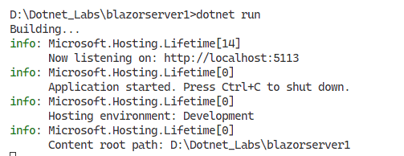

   10. ใน vs code ให้เปิดไฟล์ `d:\Dotnet_Labs\blazorserver1\Properties\launchSettings.json`
 แล้วกด ctrl+คลิกเมาส์ ที่ url ในบรรทัด `"applicationUrl": "http://localhost:5113",`

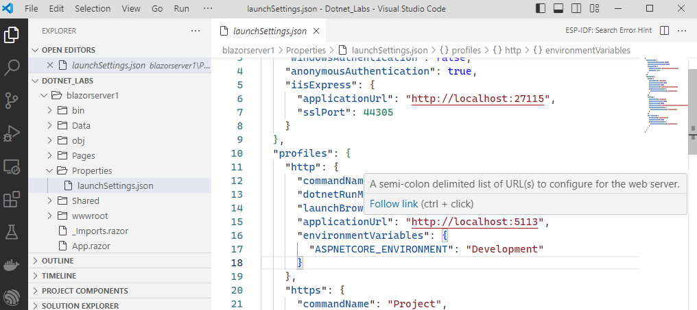


   11. ระบบปฏิบัติการจะเปิดหน้าต่าง web browser แล้วพาไปที่ url และ port ตามที่ระบุไว้ หาก ctrl+คลิกเมาส์ไม่ได้ ให้คัดลอก url พร้อมหมายเลข port มาวางใน URL ของ web browser ด้วยตนเอง

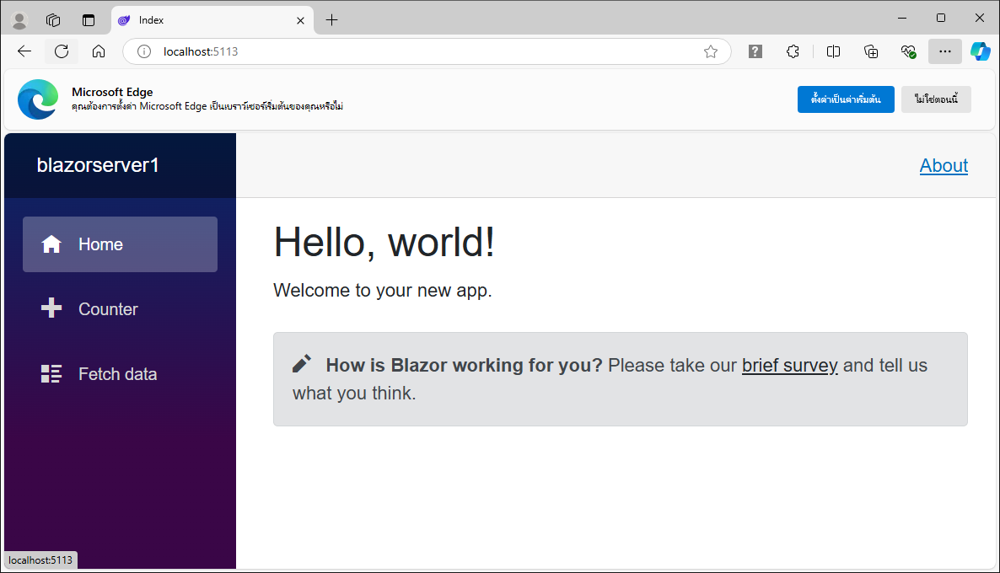

   12. ทดลองใช้งานเว็บไซต์  

### ส่ง project ขึ้นไปเก็บบน github

   13. เมื่อทดลองใช้งานเว็บไซต์แล้ว ให้กลับมาที่หน้าต่าง terminal แล้วกด ctrl+C เพื่อหยุดการทำงานของ web server


   14. ในหน้าต่าง terminal  พิมพ์

```cmd
    git init 
``` 

เพื่อสร้าง repository ขึ้นใน working directory และจะได้รับรายงานจาก git ดังตัวอย่างในรูปนี้

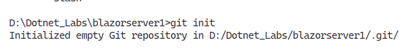

   15. คลิกที่ปุ่ม git ในแถบ extension จะเห็นว่ามีไฟล์ต่างๆ ที่มีการแก้ไขจำนวนมาก ให้บันทึกตัวเลขในวงกลมสีฟ้าไว้เพื่อเปรียบเทียบกับขั้นตอนถัดไป 

    
   16. ในที่นี้จะมีไฟล์บางประเภท ที่ไม่ต้องส่งขึ้นไปเก็บบน github เนื่องจากเป็นไฟล์ที่เกิดจากการ build ของ dotnet ซึ่งถ้าต้องการใช้งาน เราก็สามารถ build  ใหม่ได้ตามต้องการ ดังนั้น ให้ ignore ไฟล์ดังกล่าว ในหน้าต่าง terminal (cmd) ให้พิมพ์

```cmd
    dotnet new gitignore 
``` 

   17. สังเกตุว่าไฟล์บางชนิด (เช่น exe, dll) จะถูก ignode จาก git และตัวเลขในวงกลมสีฟ้าจะลดลง
  
   18. ในหน้าต่าง terminal พิมพ์

```cmd
    git add . 
``` 

   19. ในหน้าต่าง terminal พิมพ์

```cmd
    git commit -m"initial commmit" 
``` 

   20. ในหน้าต่าง source control (จะปรากฏเมื่อคลิกปุม git) ให้คลิก `Publish Branch`

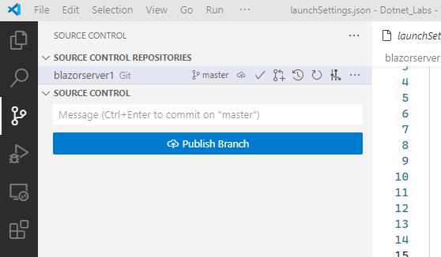

   21. ให้เลือก `Publish to GitHub public repository...` 

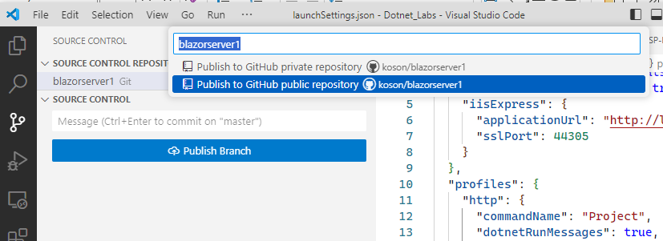

   22. ตรวจสอบการมีอยู่ของ repository ที่ push ขึ้นไปไว้บน GitHub

  


